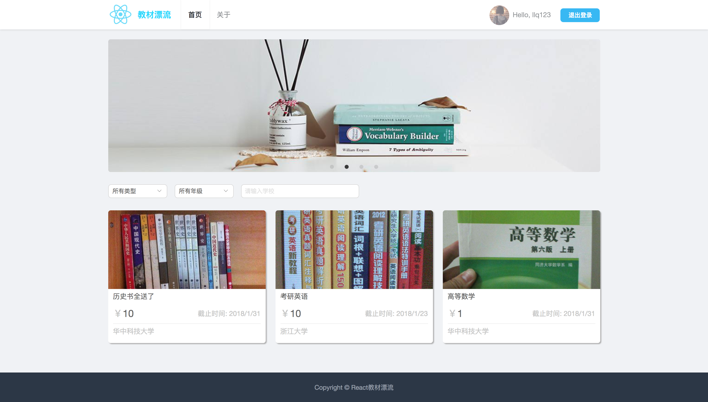
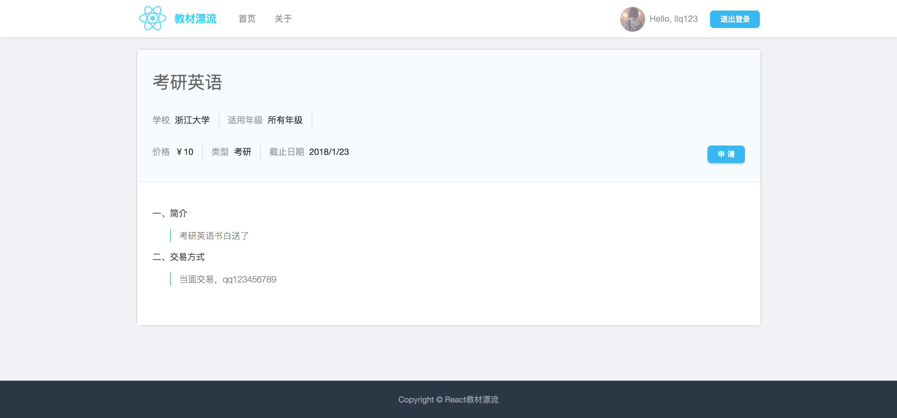

###教材漂流网页端

React+Redux学习项目，学习参考于 https://github.com/husterxsp/IT-part-time

运行：

1. 安装并运行mongodb
2. npm install 
3. npm run server, 开启服务
4. npm run dev, 运行
5. 访问 http://127.0.0.1:8080/

运行截图：

主页

详情页

 